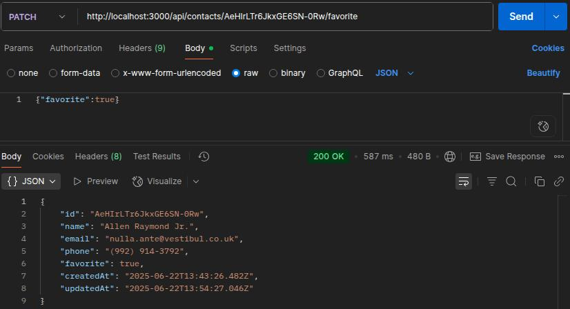
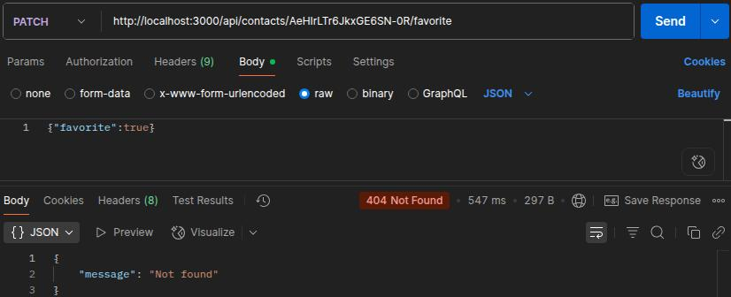

# goit-node-rest-api
Домашні завдання курсу Fullstack. Back End Development: Node.js. 

# Тема 6. PostgresSQL та Sequelize. Домашня робота

## Підключеня до БД та створеня таблиці 
```sql
CREATE TABLE public.contacts (
	"id" serial NOT NULL,
	"name" varchar(128) NOT NULL,
	email varchar(255) NOT NULL,
	phone varchar(24) NOT NULL,
	favorite boolean DEFAULT false,
  "createdAt" TIMESTAMP WITH TIME ZONE NOT NULL, 
  "updatedAt" TIMESTAMP WITH TIME ZONE NOT NULL,
	CONSTRAINT contacts_pk PRIMARY KEY (id)
);
```
### наповнення таблиці первинними значеннями
```sql
INSERT INTO public.contacts 
 ("name", email, phone, favorite, "createdAt", "updatedAt")
VALUES
 ('Allen Raymond', 'nulla.ante@vestibul.co.uk', '(992) 914-3792', false, now(), now()),
 ('Chaim Lewis', 'dui.in@egetlacus.ca', '(294) 840-6685', false, now(), now()),
 ('Kennedy Lane', 'mattis.Cras@nonenimMauris.net', '(542) 451-7038', false, now(), now());
```


## Створення маршруту PATCH /api/contacts/favorite




