# goit-node-rest-api
Домашні завдання курсу Fullstack. Back End Development: Node.js. 

# Домашнє завдання. Тема 4. REST API

## GET /api/contacts 

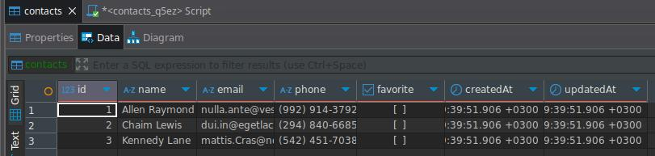

## GET /api/contacts/ 

### Повернення об'єкта контакту за id в json-форматі зі статусом 200 .
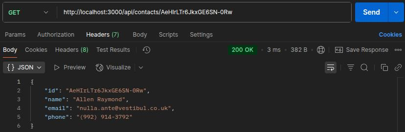
### Повернення json з повідомленням {"message": "Not found"} зі статусом 404, якщо контакт за id не знайдено .
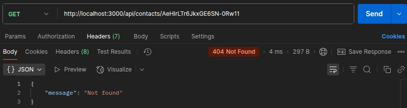

## POST /api/contacts

### Повернення json з повідомленням {"message": error.message} зі статусом 400, якщо відсутні обов'язкові поля або передані поля мають не валідне значення .
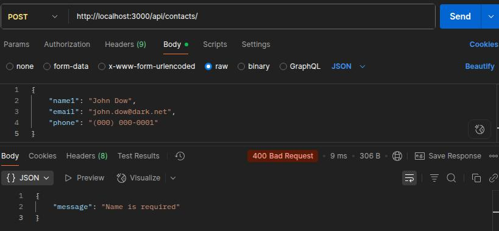
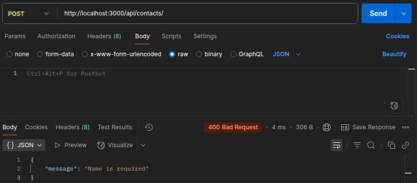
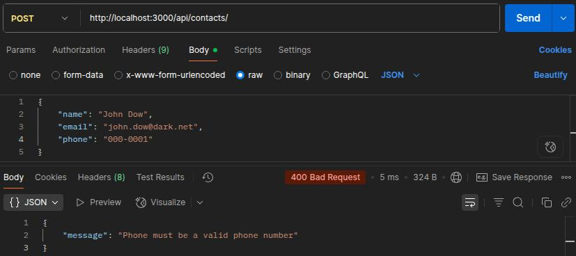
### Повернення новоствореного об'єкта з полями {id, name, email, phone} і статусом 201.
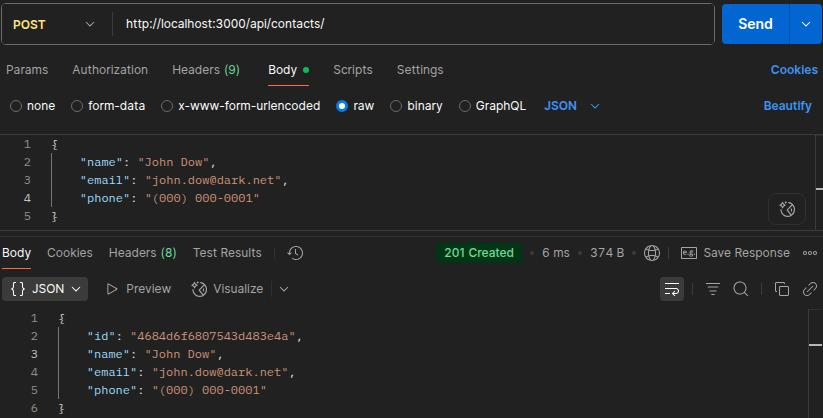

## DELETE /api/contacts/

### Повернення об'єкта видаленого контакту в json-форматі зі статусом 200 .
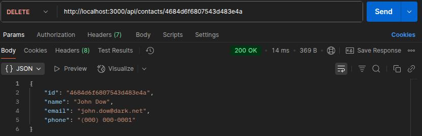
### Повернення json з повідомленням {"message": "Not found"} зі статусом 404, якщо контакт за id не знайдено .
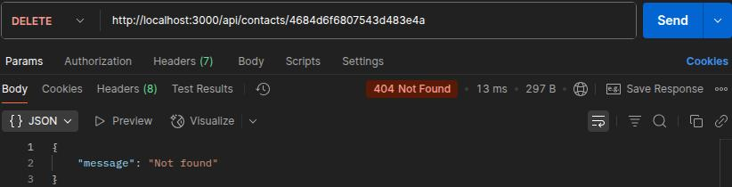

## PUT /api/contacts/ — 25 балів

### Повернення json з повідомленням {"message": "Body must have at least one field"} зі статусом 400, якщо запит на оновлення здійснено без передачі в body хоча б одного поля .
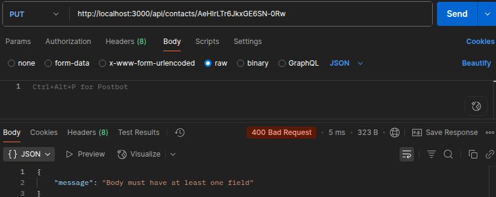
### Повернення json з повідомленням {"message": error.message} зі статусом 400, якщо передані поля мають не валідне значення .
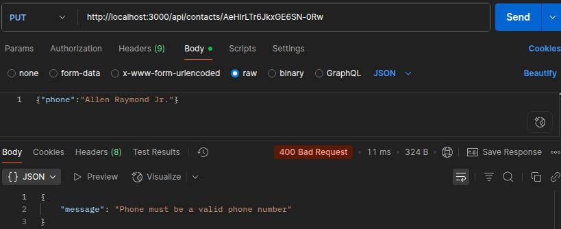
### Повернення оновленого об'єкта контакту зі статусом 200 .
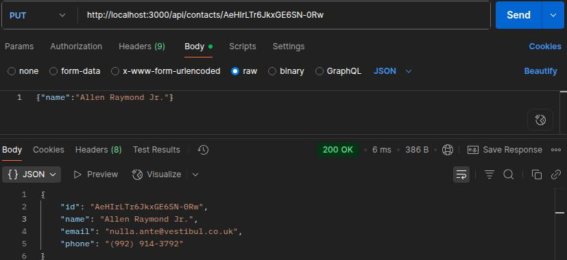
### Повернення json з повідомленням {"message": "Not found"} зі статусом 404, якщо контакт за id не знайдено .
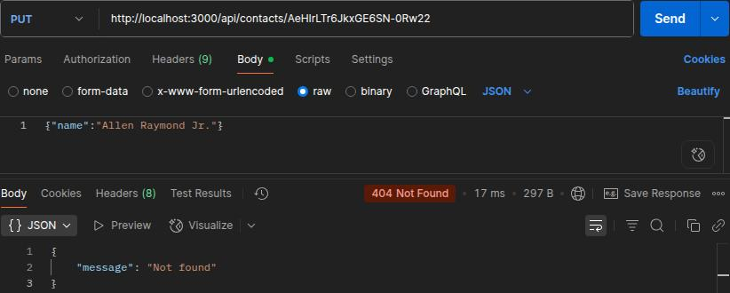